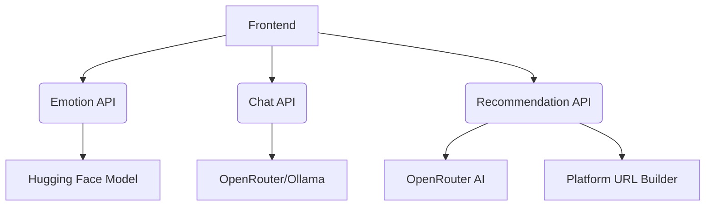

```markdown
# Emotion-Aware Content Recommendation System

A multi-service application that analyzes user emotions from text, provides chat responses, and recommends supportive content across various platforms.

## Features

- **Real-time Emotion Detection**: Uses Hugging Face's `roberta-base-go_emotions` model
- **AI Chat Interface**: Hybrid model serving with OpenRouter and Ollama fallback
- **Multi-platform Recommendations**: Generates search queries for 8+ content types across 30+ platforms
- **Interactive Dashboard**: Visualizes emotion trends and content recommendations
- **Hybrid Architecture**: Combines cloud APIs with local model serving

## System Architecture



## Components

1. **Emotion Detection Service** (`app02.py`)
   - Flask API on port 5002
   - Detects primary emotion and secondary emotions
   - Web interface for text input/analysis

2. **Chat Service** (`ollama.py`)
   - Flask API on port 5003
   - Hybrid chat completion with OpenRouter + Ollama
   - Response caching and model fallback

3. **Recommendation Service** (`recommender.py`)
   - Flask API on port 5004
   - Generates platform-specific search queries
   - Content type mapping and URL building

4. **Query Agent** (`query_agent.py`)
   - OpenRouter integration for query generation
   - Emotion-to-content type mapping
   - Query cleaning and validation

5. **Frontend Interface** (`page.html`)
   - Real-time chat interface
   - Emotion visualization dashboard
   - Recommendation sidebar with direct links

## Installation

### Prerequisites
- Python 3.9+
- Node.js (for frontend dependencies)
- Ollama (optional for local models)

```bash
# Clone repository
git clone https://github.com/yourusername/emotion-recommender.git
cd emotion-recommender

# Install Python dependencies
pip install flask flask-cors requests python-dotenv transformers torch
```

## Configuration

1. Create `.env` file:
```ini
OPENROUTER_API_KEY=your_openrouter_api_key
FLASK_DEBUG=True
```

2. Configure services:
| Service          | Port | Environment Variables         |
|------------------|------|--------------------------------|
| Emotion Detection| 5002 | -                              |
| Chat Service     | 5003 | OPENROUTER_PRIMARY_MODEL       |
| Recommendation   | 5004 | -                              |

## Running the System

```bash
# Start Emotion Detection Service
python app02.py

# Start Chat Service
python ollama.py

# Start Recommendation Service
python recommender.py

# Open frontend in browser
open page.html
```

## API Endpoints

### Emotion Detection
- `POST /detect-emotion` - Analyze text emotions
- `GET /health` - Service status check

### Chat Service
- `POST /chat` - Get AI chat response
- `GET /models` - List available models

### Recommendation Service
- `POST /recommend` - Get content recommendations
- `GET /test` - Service status check

## Frontend Usage

1. Open `page.html` in browser
2. Type messages in chat interface
3. View real-time:
   - Emotion analysis charts
   - AI responses
   - Content recommendations
   - System status indicators

## Key Dependencies

- Flask (Web framework)
- Transformers (NLP models)
- OpenRouter API (AI services)
- Chart.js (Data visualization)
- Ollama (Local LLM serving)

## License

MIT License - See [LICENSE](LICENSE) for details
```
