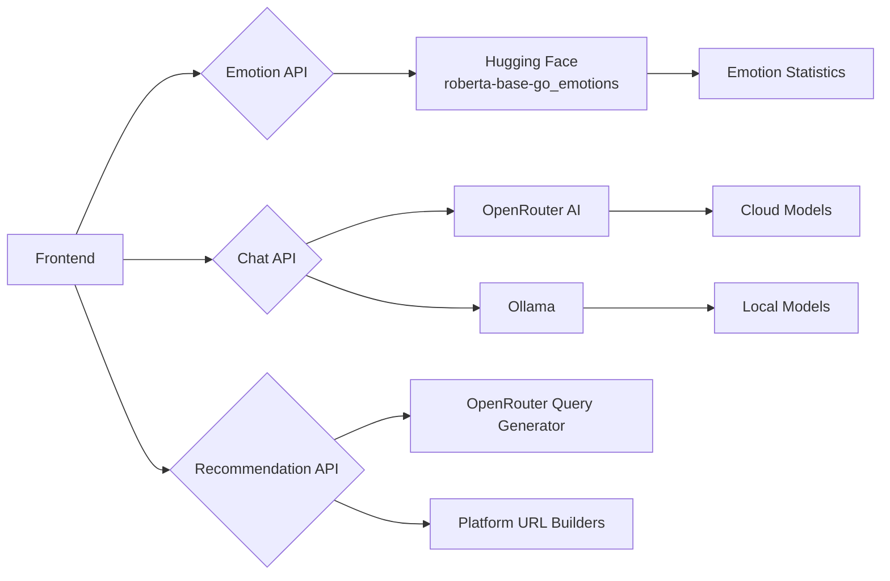

# Emotion-Aware Conversational AI with Content Recommendations

A full-stack AI system that combines real-time emotion analysis, intelligent conversational capabilities, and personalized content recommendations across multiple platforms.


## Features

### Core Capabilities
- **Real-time emotion detection** - Analyzes text input to identify 27 distinct emotions
- **Hybrid AI chat system** - Utilizes multiple AI providers with seamless failover
- **Multi-platform content recommendations** - Suggests content across 8 categories and 30+ platforms
- **Interactive visualization** - Tracks and displays emotion trends over time
- **System health monitoring** - Provides real-time status of all system components

### Advanced Features
- Response caching for improved performance
- Dynamic query generation powered by large language models
- Platform-specific intelligent URL construction
- Mobile-responsive UI with intuitive collapsible panels
- Streaming API support for real-time chat responses

## System Architecture



## Component Details

### 1. Emotion Detection Service (`app02.py`)
- **Port**: 5002
- **Technology**: Hugging Face Transformers pipeline
- **Endpoints**:
  - `POST /detect-emotion`: Analyzes text for emotional content
  - `GET /health`: Reports service status
  - `GET /`: Web interface for testing

### 2. Hybrid Chat Service (`ollama.py`)
- **Port**: 5003
- **Key Features**:
  - Dual-provider architecture (OpenRouter + Ollama)
  - LRU caching strategy for frequently requested responses
  - Automatic provider failover mechanism
  - Streaming support with configurable token batching
- **Configuration Options**:
  ```ini
  OPENROUTER_API_KEY=your_api_key
  OPENROUTER_PRIMARY_MODEL=microsoft/phi-4-reasoning:free
  OLLAMA_MODEL=llama2
  FALLBACK_MODEL=mistral
  ```

### 3. Recommendation Engine (`recommender.py`)
- **Port**: 5004
- **Components**:
  - Platform-specific URL builders
  - Content type categorization system
  - Query sanitization and validation pipeline
- **Processing Flow**:
  1. Processes text and emotion inputs
  2. Generates contextually relevant queries via LLM
  3. Constructs platform-specific search URLs
  4. Returns formatted recommendation packages

### 4. Frontend Interface (`page.html`)
- **Technologies**:
  - Chart.js for data visualization
  - Responsive design with Flexbox
  - Dynamic CSS animations and transitions
- **User Experience Features**:
  - Threaded conversation display
  - Input validation with character limits
  - Visual typing indicators
  - Graceful error handling

## Getting Started

### Prerequisites
- Python 3.9+
- [Ollama](https://ollama.ai/) (for local model support)
- [OpenRouter API key](https://openrouter.ai/)

### Installation

```bash
# Clone repository
git clone https://github.com/yourusername/emotion-ai-system.git
cd emotion-ai-system

# Create virtual environment
python -m venv venv
source venv/bin/activate  # Linux/Mac
venv\Scripts\activate     # Windows

# Install dependencies
pip install -r requirements.txt
```

### Configuration

1. Create a `.env` file in the project root:
```ini
# API Keys and Core Configuration
OPENROUTER_API_KEY=your_api_key_here
FLASK_DEBUG=True

# Service Port Configuration
EMOTION_PORT=5002
CHAT_PORT=5003
RECOMMEND_PORT=5004

# Model Settings
OPENROUTER_PRIMARY_MODEL=microsoft/phi-4-reasoning:free
OLLAMA_PRIMARY_MODEL=llama2
FALLBACK_MODEL=mistral
```

2. Download required Ollama models:
```bash
ollama pull llama2
ollama pull mistral
```

### Launching the System

```bash
# Terminal 1 - Start Emotion Detection Service
python app02.py

# Terminal 2 - Start Chat Service
python ollama.py

# Terminal 3 - Start Recommendation Service
python recommender.py

# Open the frontend in your browser
open page.html  # Or use a live server extension in your IDE
```

## API Documentation

### Emotion Detection API
**Endpoint**: `POST http://localhost:5002/detect-emotion`

**Request**:
```json
{
  "text": "I'm feeling excited about this new project!"
}
```

**Response**:
```json
{
  "primary_emotion": "excitement",
  "primary_score": 0.9345,
  "secondary_emotions": [
    {"emotion": "joy", "score": 0.8765},
    {"emotion": "optimism", "score": 0.7890}
  ],
  "message": "I can sense your excitement!"
}
```

### Chat API
**Endpoint**: `POST http://localhost:5003/chat`

**Request**:
```json
{
  "text": "Explain quantum computing basics",
  "stream": false
}
```

**Response**:
```json
{
  "model": "microsoft/phi-4-reasoning:free",
  "provider": "openrouter",
  "response": "Quantum computing leverages quantum mechanics..."
}
```

### Recommendation API
**Endpoint**: `POST http://localhost:5004/recommend`

**Request**:
```json
{
  "text": "I want to learn about machine learning",
  "emotion": "curiosity",
  "platforms": ["youtube", "coursera", "spotify"]
}
```

**Response**:
```json
{
  "recommendations": [
    {
      "platform": "YouTube",
      "query": "machine learning for beginners",
      "url": "https://www.youtube.com/results?search_query=machine+learning+for+beginners"
    },
    {
      "platform": "Coursera",
      "query": "introduction to machine learning course",
      "url": "https://www.coursera.org/search?query=introduction%20to%20machine%20learning%20course"
    },
    {
      "platform": "Spotify",
      "query": "machine learning podcast for beginners",
      "url": "https://open.spotify.com/search/machine%20learning%20podcast%20for%20beginners"
    }
  ]
}
```

## Customization

### Adding New Content Platforms
1. Update the `PLATFORM_MAP` in `query_agent.py`:
```python
PLATFORM_MAP = {
    # Existing entries
    ContentType.NEW_TYPE: ["New Platform 1", "New Platform 2"]
}
```

2. Add the corresponding URL builder in `recommender.py`:
```python
PLATFORM_URL_BUILDERS = {
    # Existing entries
    "New Platform": lambda query: f"https://newplatform.com/search?q={query}"
}
```

### Customizing Emotion Responses
Modify the `emotion_responses` dictionary in `app02.py`:
```python
emotion_responses = {
    # Existing entries
    "excitement": "Your customized response for excitement",
}
```

## Troubleshooting

### Common Issues and Solutions

1. **Ollama Connection Failures**
   - Verify Ollama service is running: `ollama serve`
   - Check firewall settings for port 11434
   - Ensure Ollama models are properly downloaded

2. **OpenRouter API Errors**
   - Validate API key in your `.env` file
   - Check rate limits on the [OpenRouter Dashboard](https://openrouter.ai/keys)
   - Verify network connectivity to OpenRouter services

3. **Model Loading Issues**
   - Ensure sufficient system resources (minimum 16GB RAM recommended)
   - For GPU acceleration, verify PyTorch is installed with CUDA support
   - Check disk space for model storage requirements

4. **Frontend Connection Problems**
   - Verify all three services are running
   - Check browser console for CORS-related errors
   - Ensure the correct ports are specified in frontend configuration

## Contributing

We welcome contributions to improve this system! Please see our [Contributing Guidelines](CONTRIBUTING.md) for more information on how to submit pull requests, report issues, and suggest enhancements.

## License

This project is licensed under the MIT License - see the [LICENSE](LICENSE) file for details.

---

**Disclaimer**: This project is for educational and research purposes only. Use of third-party APIs and models is subject to their respective terms of service.
